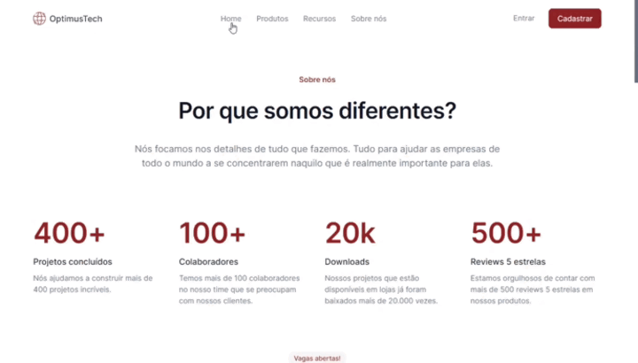

<h1 align="center">
  <a href="https://djonibourscheid.github.io/7DaysOfCode/">7 Days of Code</a>
  /
  <a href="https://djonibourscheid.github.io/7DaysOfCode/#LandingPage">Landing Page</a>
</h1>

Criando uma página completa de 'Vagas' de uma empresa fictícia para melhorar o HTML e CSS

  <a href="#-projeto">Projeto</a> •
  <a href="#-layout">Layout</a> •
  <a href="#-desafios-extras">Desafios Extras</a> •
  <a href="#-tecnologias">Tecnologias</a> •
  <a href="#-autor">Autor</a> •
  <a href="#-licença">Licença</a>

<h4 align="center">
  🚧 Projeto em desenvolvimento... 🏗 50% 🚧
</h4>

## ✨ Projeto

  

  

## 🎨 Layout
O layout da aplicação está disponível no Figma:

## ⚔ Desafios Extras
- [ ] Responsividade

## 🛠 Tecnologias
Foram usadas na construção do projeto:
- HTML
- CSS

## 👋 Autor
<a href="https://github.com/djonibourscheid">
  

  <b>Djoni Bourscheid</b>
</a>

## 📝 Licença
Este projeto esta sobe a licença [MIT](./LICENSE).

Feito com ❤️ por Djoni Bourscheid 👋 [Entre em contato!](https://www.linkedin.com/in/djonibourscheid/)